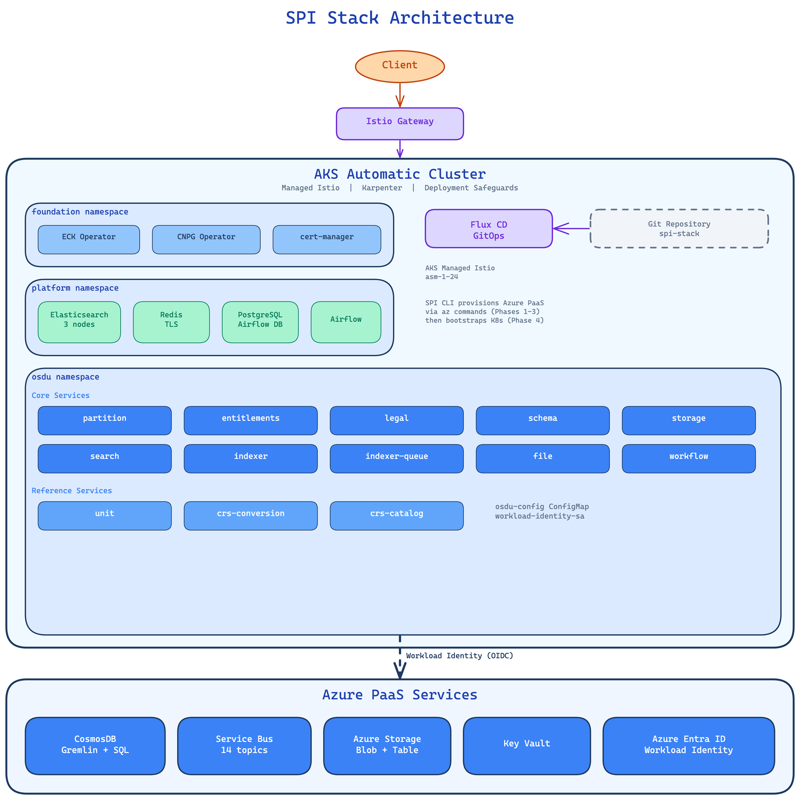
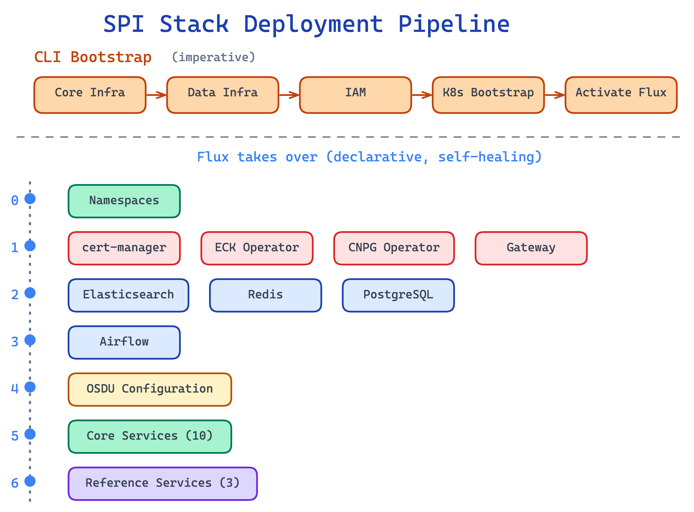
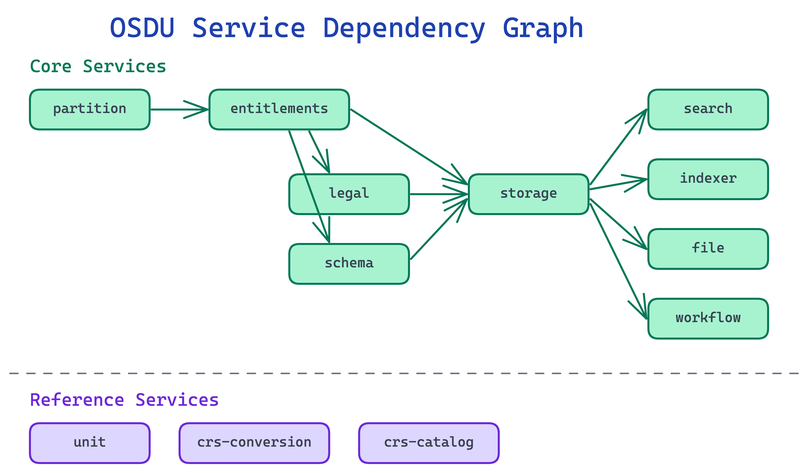

# Architecture

> This document is the 30,000-ft overview of SPI Stack. For deeper explainers of
> specific subsystems (deployment lifecycle, Bicep, Flux reconciliation, Workload
> Identity, ingress, secret lifecycle), see [`docs/design/`](design/). Each design
> doc links back to the relevant ADRs.

## Overview

SPI Stack deploys the OSDU platform on Azure with a hybrid provisioning model: Bicep declares every Azure resource, the `spi` CLI orchestrates the seams Bicep cannot cover (resource group creation, soft-delete Key Vault recovery, K8s bootstrap, Istio CNI chaining), and Flux CD continuously reconciles everything inside the cluster. Unlike a cloud-agnostic stack where all middleware runs in-cluster, SPI Stack offloads data services to Azure PaaS (Cosmos DB, Service Bus, Storage, Key Vault, Entra ID) and keeps in-cluster workloads only where no managed equivalent exists.

### How the system works

SPI Stack has three control planes working together:

1. **The `spi` CLI** bootstraps the environment. It creates the resource group, submits Bicep deployments for the cluster (`infra/aks.bicep`) and the rest of the Azure PaaS surface (`infra/main.bicep`), bootstraps the cluster (namespaces, StorageClasses, ServiceAccount, `osdu-config` ConfigMap), submits a third Bicep deployment (`infra/flux.bicep`) that activates the AKS Flux extension, then writes a small set of runtime Key Vault secrets once in-cluster middleware is Ready.
2. **Flux CD** manages desired-state reconciliation. It watches this Git repository and the OCI chart registry, and continuously converges the cluster to match.
3. **Kubernetes operators** (ECK, CNPG, cert-manager, trust-manager) manage the lifecycle of individual middleware systems beneath the Flux layer.

The CLI does the minimum work needed to get Azure resources provisioned and Flux running. After that, Flux owns everything inside the cluster.

> **Dev/test posture.** The CLI and defaults are tuned for Azure dev/test environments: generated shared credentials for in-cluster middleware, Let's Encrypt or self-signed certificates depending on ingress mode, and optional live credential display. This makes the stack easy to spin up and inspect, but it should not be confused with a hardened production operating model.

## System Architecture



Clients connect through the AKS managed Istio gateway. OSDU services run in the cluster with Workload Identity and reach Azure PaaS (Cosmos DB, Service Bus, Storage, Key Vault) outside the cluster boundary. Flux CD reconciles all in-cluster state from this Git repository.

## GitOps + Bootstrap Boundary

This project uses a **GitOps + bootstrap** model (see [ADR-008](decisions/008-bicep-for-azure-provisioning.md) and [ADR-009](decisions/009-flux-cd-for-gitops.md)):

1. The CLI performs Azure-specific bootstrap work.
   - Provision the AKS cluster and all Azure PaaS resources via Bicep.
   - Bootstrap the cluster with namespaces, StorageClasses, ServiceAccount, and the `osdu-config` ConfigMap.
   - Activate the AKS Flux extension (also declared in Bicep).
   - Once middleware is Ready, write runtime Key Vault secrets that depend on in-cluster seed passwords.
2. Flux then owns steady-state reconciliation for everything else.

This keeps the in-cluster graph clean, while accepting that Azure infrastructure must land imperatively before Flux can start.

## Deployment Pipeline



The deployment pipeline has two phases: the CLI's Bicep-driven bootstrap (top) and Flux's layered reconciliation plus the schema-load one-shot (bottom). The dashed line marks the handoff point.

### CLI phases

| Phase | Mechanism | What |
|-------|-----------|------|
| 1. Resource Group | `az group create` | Resource group for the environment |
| 2. AKS + managed Istio | Raw Bicep (`infra/aks.bicep`) | AKS Base SKU cluster with Node Autoprovisioning (NAP / Karpenter), BYO VNet + NAT gateway, managed Istio |
| 3. Azure PaaS | Bicep (`infra/main.bicep`) | Managed Identity + federated credentials, Key Vault + static metadata secrets, ACR, Cosmos DB Gremlin + per-partition SQL, per-partition Service Bus (topics + subscriptions), common + per-partition Storage, RBAC role assignments |
| 4. K8s bootstrap | `kubectl apply` | Namespaces, StorageClasses, `workload-identity-sa`, `osdu-config` ConfigMap, `spi-ingress-config` ConfigMap |
| 5. Flux activation | Bicep (`infra/flux.bicep`) | AKS Flux extension + `fluxConfigurations` with two Kustomizations (stack profile, ingress mode) |
| 6. Runtime KV secrets | `az keyvault secret set` | Per-partition Elasticsearch credentials, Redis hostname and password, written from the generated seed (no wait for middleware) |

A full `spi up` typically takes ~45-50 minutes, dominated by AKS provisioning (~30 min) with PaaS Bicep (~3 min), K8s bootstrap (~1 min), and the Flux extension Bicep (~10-15 min) filling the remainder. `spi up --dry-run` runs `az deployment group what-if` against both Bicep templates and skips everything after phase 1.

## Runtime Architecture

### Namespace model

Three application namespaces:

| Namespace | Purpose | Istio injection | Contents |
|-----------|---------|-----------------|----------|
| **foundation** | Cluster operators | No | ECK, CNPG, cert-manager, trust-manager |
| **platform** | Middleware and Gateway | No | Elasticsearch, Redis, PostgreSQL (Airflow), Airflow, Istio Gateway |
| **osdu** | OSDU services | Yes | OSDU service deployments, schema-load Job, `osdu-config`, `workload-identity-sa` |

The `flux-system` namespace is managed by the AKS Flux extension and hosts Flux controllers, the `GitRepository`, and the two top-level Kustomizations. `aks-istio-system` and `aks-istio-ingress` are owned by AKS. See [ADR-006](decisions/006-three-namespace-model.md).

### Layered dependency model

The core profile (`software/stacks/osdu/profiles/core/stack.yaml`) defines seven major dependency layers (numbered 0-6) plus per-partition and schema-load one-shot Jobs. Sub-letter groupings (`0a`/`0b`, `4a`/`4b`) reconcile in parallel within their parent layer.

| Layer | Name | Depends on |
|-------|------|------------|
| 0a | Namespaces | none |
| 0b | Karpenter NodePools | 0a |
| 1 | Operators (ECK, CNPG), cert-manager, trust-manager, Gateway | 0a (trust-manager on cert-manager) |
| 2 | Middleware (Elasticsearch, Redis, PostgreSQL) | 1 + 0b |
| 3 | Airflow | 2 (PostgreSQL) |
| 4a | OSDU configuration placeholder | 0a |
| 4b | Bootstrap (trust-manager Bundles + Redis DestinationRule) | trust-manager, ES, Redis, 4a |
| 5 | Core OSDU services | 4b + 0b |
| 5a | Partition + entitlements bootstrap (per-partition Jobs) | 5 |
| 5b | Schema load (one-shot Job) | 5a |
| 6 | Reference services | 5, 5b |

The ingress profile (`software/stacks/osdu/ingress/<mode>/`) adds Kustomizations at Layer 1 (cert issuers, ExternalDNS in `dns` mode, TLS overlays) and Layer 6 (HTTPRoutes). See [ADR-007](decisions/007-layered-kustomization-ordering.md) and [ADR-012](decisions/012-ingress-profiles.md).

## AKS Compute (Base SKU + Node Autoprovisioning)

SPI Stack runs the AKS Base SKU with Node Autoprovisioning. It previously used
AKS Automatic; [ADR-021](decisions/021-aks-base-node-autoprovisioning.md)
supersedes [ADR-002](decisions/002-aks-automatic.md) because Automatic began
enforcing a non-bypassable guardrail that blocks the
`MutatingWebhookConfiguration` objects cert-manager and CloudNativePG require.
The Base SKU keeps the features the stack depends on, wired explicitly:

| Feature | What it does |
|---------|-------------|
| **Karpenter (NAP)** | Node Auto-Provisioning; user-declared NodePool CRs at Layer 0b |
| **Managed Istio** | Service mesh with mTLS, sidecar injection, ingress gateway |
| **Workload Identity** | OIDC issuer + federated credentials (explicit on Base) |
| **Azure RBAC for Kubernetes** | Cluster authorization (explicit on Base) |
| **Cilium CNI** | eBPF networking in overlay mode |
| **Managed Prometheus / Container Insights** | Cluster metrics and logs to Azure Monitor / Log Analytics |
| **Application Insights** | Optional per-service request, dependency, and exception telemetry (`spi up --application-insights`; [ADR-023](decisions/023-application-insights-telemetry.md)) |

Deployment Safeguards were an Automatic-only feature and are no longer
cluster-enforced. Compliance does not regress: the local `osdu-spi-service`
Helm chart bakes the same pod hardening into its templates so services comply
at authoring time:

- `securityContext.runAsNonRoot: true`
- `securityContext.seccompProfile.type: RuntimeDefault`
- `securityContext.capabilities.drop: [ALL]`
- `securityContext.allowPrivilegeEscalation: false`
- Resource requests and limits defined
- Liveness and readiness probes defined

See [ADR-021](decisions/021-aks-base-node-autoprovisioning.md) and
[ADR-004](decisions/004-local-helm-chart-safeguards.md).

## Ingress Profiles

`spi up --ingress-mode <mode>` selects one of three profiles. The mode is plumbed into `infra/flux.bicep` as the `ingress` Kustomization path and into the `spi-ingress-config` ConfigMap consumed by Flux `postBuild` substitutions.

| Mode | Hostname source | TLS | DNS management | Use case |
|------|-----------------|-----|----------------|----------|
| `azure` (default) | Azure-assigned `<label>.<region>.cloudapp.azure.com` | Let's Encrypt HTTP-01 (single host) | none | Dev spin-up; zero config |
| `dns` | `*.<user-zone>` (osdu, kibana, airflow) | Let's Encrypt HTTP-01 (multi-host) | ExternalDNS to Azure DNS Zone | Team environments |
| `ip` | bare ingress IP, no hostname | none | none | Smoke tests and debug |

See [ADR-012](decisions/012-ingress-profiles.md).

## Service Catalog



The diagram shows simplified service-to-service dependencies for the core OSDU APIs. Shared middleware dependencies (Elasticsearch, Redis) are omitted for clarity.

### Core services (Layer 5)

| Service | Azure PaaS dependencies | In-cluster dependencies |
|---------|-------------------------|-------------------------|
| partition | Redis | none |
| entitlements | Cosmos DB Gremlin, Redis | none |
| legal | Cosmos DB SQL, Service Bus, Storage | Redis |
| schema | Cosmos DB SQL, Service Bus, Storage | none |
| storage | Cosmos DB SQL, Service Bus, Storage | Redis |
| search | Cosmos DB SQL | Elasticsearch, Redis |
| indexer | Cosmos DB SQL, Service Bus | Elasticsearch, Redis |
| indexer-queue | Service Bus | none |
| file | Cosmos DB SQL, Storage | Redis |
| workflow | Cosmos DB SQL, Storage | Airflow |

### Reference services (Layer 6)

| Service | Notes |
|---------|-------|
| unit | Unit conversion; standalone |
| crs-conversion | CRS transformation; downloads SIS data in an init container |
| crs-catalog | CRS reference catalog; standalone |

All services use OCI Helm charts pinned to full Git SHAs, rendered through the local `osdu-spi-service` chart (ADR-004).

## Data Flow

```
                         Azure Entra ID
                              |
                         JWT Token
                              |
                              v
Client --> Istio Gateway --> OSDU Service --+--> Cosmos DB (read/write records)
                                            +--> Service Bus (publish events)
                                            +--> Azure Storage (blob/table ops)
                                            +--> Key Vault (fetch secrets)
                                            +--> Elasticsearch (search/index)
                                            +--> Redis (cache)
                                                      |
                              +-----------------------+
                              v
              indexer-queue (Service Bus consumer)
                              |
                              v
                    indexer (Elasticsearch writer)
```

## Identity and Access

A single User-Assigned Managed Identity (`osdu-identity`) is shared by all OSDU services. A federated credential binds it to the `workload-identity-sa` ServiceAccount in the `osdu` namespace. Pods with the `azure.workload.identity/use: "true"` label get projected tokens and exchange them for Entra ID access tokens at runtime.

| Component | Detail |
|-----------|--------|
| Identity | User-Assigned Managed Identity (`osdu-identity`) |
| ServiceAccount | `workload-identity-sa` in `osdu` |
| Token path | `/var/run/secrets/azure/tokens/token` |
| Exchange | Entra ID token exchange via AKS OIDC issuer |

### RBAC roles assigned

| Role | Scope | Purpose |
|------|-------|---------|
| Key Vault Secrets User | Vault | Read secrets |
| Storage Blob Data Contributor | Common + per-partition accounts | Blob operations |
| Storage Table Data Contributor | Common + per-partition accounts | Table operations |
| Azure Service Bus Data Owner | Per-partition namespace | Publish/consume events and support Service Bus management clients |
| AcrPull | ACR | Pull container images |

A second UAMI (`external-dns-identity`, scoped `DNS Zone Contributor` on the zone's resource group) is provisioned conditionally when the ingress mode is `dns`. See [ADR-005](decisions/005-workload-identity.md) and [ADR-012](decisions/012-ingress-profiles.md).

## Reconciliation Lifecycle

Two reconciliation loops keep the cluster converged.

### Infrastructure loop

Changes to this repository (middleware manifests, profile definitions, service YAML) flow through the `GitRepository` source. Flux polls the remote, detects new commits, and reconciles the `stack` and `ingress` Kustomizations in dependency order.

### Service update loop

The default service baseline comes from each SPI service repository's latest
successful `main` build. The engineering system publishes that build as
`main-snapshot`; `spi up` resolves the tag once, pins its immutable OCI digest,
and writes the resulting fleet to `osdu-flux/osdu-image-lock`. Service
Kustomizations consume that ConfigMap through Flux post-build substitution.

`--image-tag` selects an exact shared tag such as a coordinated release.
`--image-ref` is an advanced path for resolving the same Git feature ref to each
repository's `sha-<commit>` image. Run `spi reconcile --refresh-images` to
refresh the configured selector. `--image-source community` retains the prior
OSDU GitLab resolver as a fallback.
`scripts/resolve-image-tags.py --update` remains available for static image
references such as the schema-load Job.

### Suspend and resume

`spi reconcile --suspend` patches `spec.suspend: true` on the `GitRepository`; Flux stops fetching new revisions. `spi reconcile` (no flag) triggers a one-shot reconcile. `spi reconcile --resume` unpins the source. `spi status` and `spi info` surface a suspend warning when the source is pinned.

## Configuration and Secret Model

### osdu-config ConfigMap

Created by the CLI during K8s bootstrap and mounted into every OSDU service via `envFrom`:

| Key | Source |
|-----|--------|
| `DOMAIN` | Ingress hostname or IP (mode-dependent) |
| `DATA_PARTITION` | Primary partition name |
| `AZURE_TENANT_ID` | Entra ID tenant |
| `AAD_CLIENT_ID` | Managed identity client ID |
| `KEYVAULT_URI` | Key Vault URI |
| `COSMOSDB_ENDPOINT` | Cosmos DB SQL endpoint |
| `STORAGE_ACCOUNT_NAME` | Common Storage account |
| `SERVICEBUS_NAMESPACE` | Service Bus namespace |
| `REDIS_HOSTNAME` | In-cluster Redis FQDN |
| `ELASTICSEARCH_HOST` | In-cluster Elasticsearch FQDN |

### Secret model

| Class | Store | Access path |
|-------|-------|-------------|
| Azure PaaS credentials | Entra ID | Workload Identity; no stored material |
| PaaS metadata and secret values | Azure Key Vault | SDK reads under Workload Identity (or CSI) |
| In-cluster middleware passwords | Kubernetes Secrets in `platform`/`osdu` | CLI-generated once per environment |

Most Key Vault secret values are declared in `infra/main.bicep` and resolved at deploy time (including `listKeys()` for local-auth-enabled partition Cosmos accounts). The Gremlin account disables local auth and uses Workload Identity plus a Gremlin Data Contributor assignment instead of a stored graph key. A small set of runtime secrets that depend on in-cluster seed passwords (Elasticsearch and Redis credentials, `tbl-storage-endpoint`) are written post-handoff by the CLI. See [ADR-010](decisions/010-keyvault-secret-management.md).

### CA distribution and Redis mTLS

Redis and Elasticsearch TLS CAs live as Secrets in `platform`. trust-manager (in `foundation`) mirrors them into `osdu` via `Bundle` CRs (`software/stacks/osdu/bootstrap/ca-bundles.yaml`) so the `osdu-spi-service` chart's `import-ca-certs` init container can fold them into a Java truststore. A static Istio `DestinationRule` in the same Kustomization disables mTLS to the in-cluster Redis master to avoid TLS-in-TLS. See [ADR-011](decisions/011-trust-manager-ca-distribution.md).

## Azure PaaS Resource Summary

### Per environment (shared)

| Resource | Purpose | Sizing |
|----------|---------|--------|
| AKS (Base SKU + NAP) | Compute | Karpenter-managed |
| Cosmos DB Gremlin | Entitlements graph | 4000 RU/s autoscale |
| Key Vault | Secret management | Standard, RBAC-enabled |
| ACR | Container images | Basic SKU |
| Application Insights + Log Analytics | Optional service telemetry and logs | Workspace-based, 30-day retention; disabled by default |
| Managed Identity (`osdu-identity`) | Workload Identity | Single, shared |
| Managed Identity (`external-dns-identity`) | DNS Zone Contributor | Conditional on `dns` ingress mode |

### Per partition

| Resource | Purpose | Sizing |
|----------|---------|--------|
| Cosmos DB SQL | Operational data | 4000 RU/s autoscale, 24 containers |
| Service Bus | Async messaging | Standard SKU, 14 topics, 14 subscriptions |
| Storage account | Blob and table storage | Standard LRS, 6 containers (5 service + 1 record) |

### In-cluster (per environment)

| Component | Instances | Storage | Purpose |
|-----------|-----------|---------|---------|
| Elasticsearch | 3 nodes | 128 GiB each | Search and indexing |
| Redis | 1 master + 2 replicas | 8 GiB each | Caching (TLS) |
| PostgreSQL | 3 instances (CNPG) | 10 GiB + 4 GiB WAL | Airflow metadata |
| Airflow | Webserver + Scheduler + Triggerer | n/a | Workflow orchestration |
