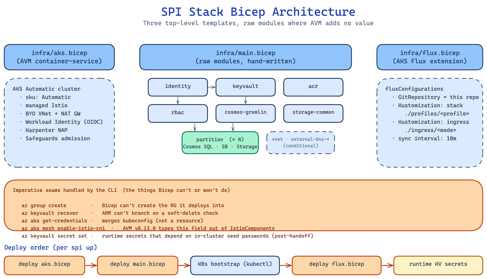

# Bicep Architecture

**What this explains.** How `infra/` is organised, why three top-level Bicep templates, what the `infra/modules/` are responsible for, and which seams the CLI handles imperatively because Bicep cannot.

**Why it matters.** Most of `spi up` is Bicep, and most failures look like `az` errors that are actually Bicep errors. Knowing which template owns which resource makes the difference between "where do I edit the schema" and "where does the error point me."

> **Companion docs.** [Deployment lifecycle](deployment-lifecycle.md) covers the timing and ordering of these deploys. [Workload Identity](workload-identity.md) explains how identity and RBAC modules wire together at runtime.

## The three top-level templates



Three Bicep entrypoints, each with a single responsibility:

| Template | Style | What it lands |
|---|---|---|
| `infra/aks.bicep` | AVM `container-service/managed-cluster` (pinned) | AKS Automatic cluster, BYO VNet + NAT gateway, managed Istio, OIDC issuer |
| `infra/main.bicep` | Raw modules under `infra/modules/` | Every other PaaS resource: identity, RBAC, Key Vault (with secrets), ACR, Cosmos DB Gremlin, per-partition (Cosmos SQL + Service Bus + Storage), common Storage, optional `external-dns-*` for `dns` ingress |
| `infra/flux.bicep` | Raw (small) | AKS Flux extension + `fluxConfigurations` with two Kustomizations (stack profile, ingress mode) |

Each deploys via `az deployment group create` against the same resource group. They run sequentially because each depends on values from the previous one (kubeconfig from AKS, identity client IDs from main, Kustomization paths from CLI inputs).

### Why split into three

A single template would work, but the three boundaries match three different lifecycles:

- **`aks.bicep`** is the slowest piece (~5-7 min) and almost never changes after first deploy.
- **`main.bicep`** changes when you add a partition, swap a PaaS sku, or wire a new identity. It deploys in ~2-3 min and re-runs idempotently.
- **`flux.bicep`** changes whenever you change profile or ingress mode (`--profile`, `--ingress-mode`). It deploys in seconds.

Splitting them also keeps `--dry-run` useful: `spi up --dry-run` runs `az deployment group what-if` against `aks.bicep` and `main.bicep` and skips everything after, so you see the ARM-level diff without paying for a full deploy.

## Why AVM for AKS and raw Bicep for the rest

AKS Automatic has a non-trivial parameter shape: system-pool VM size, Ephemeral OS disk, NAT gateway for egress, `serviceMeshProfile` for Istio, Workload Identity flags. The AVM `container-service/managed-cluster` module bundles the correct defaults and updates them as Microsoft tunes the SKU.

The PaaS modules (Key Vault, ACR, Storage, Cosmos, Service Bus, Managed Identity) are different: AVM's passthrough modules for these add a module-version axis to maintain without materially improving over raw Bicep. They are stable resources with well-known shape, so the raw modules under `infra/modules/` are small, readable, and reviewable.

The full rationale is in [ADR-008](../decisions/008-bicep-for-azure-provisioning.md).

## Module inventory (`infra/modules/`)

| Module | Resources | Notes |
|---|---|---|
| `identity.bicep` | UAMI `osdu-identity`, federated credential | Federated to `workload-identity-sa` in `osdu` namespace |
| `keyvault.bicep` | Key Vault, RBAC role assignments for UAMI, static secrets (endpoints, IDs, derived values) | `listKeys()` on Cosmos accounts; runtime secrets land later via CLI |
| `acr.bicep` | Container Registry (Basic SKU) | UAMI gets `AcrPull` |
| `cosmos-gremlin.bicep` | Cosmos DB Gremlin account + graph DB | Entitlements graph; shared across partitions |
| `partition.bicep` | Per-partition: Cosmos SQL account + 24 containers, Service Bus namespace + 14 topics + ~16 subscriptions, Storage account + 5 containers + tables, per-partition KV secrets (`{p}-cosmos-endpoint`, `{p}-storage-account-blob-endpoint`, `{p}-sb-connection`, etc.) | Looped from `main.bicep` over `dataPartitions` |
| `storage-common.bicep` | Common Storage account (legal tags, cross-partition data) | One per environment, not per partition |
| `rbac.bicep` | RBAC role assignments scoped per resource | Key Vault Secrets User, Storage Blob/Table Data Contributor, Service Bus Data Sender/Receiver, AcrPull |
| `vnet.bicep` | VNet + private subnet + NAT gateway | Conditional; only present when policy or `dns` ingress requires it |
| `external-dns-identity.bicep` | Second UAMI (`external-dns-identity`) + federated credential to ExternalDNS SA | Conditional on `--ingress-mode dns` |
| `external-dns-role.bicep` | `DNS Zone Contributor` role on the zone's RG | Conditional on `--ingress-mode dns` |

`partition.bicep` is the only looped module today. Adding a partition is `spi up --env <env> --partition p1 --partition p2`; `main.bicep` renders one partition module per name.

## Imperative seams in the CLI

Five things Bicep cannot or will not do; the CLI handles them with `az`:

1. **`az group create`.** Bicep cannot create the resource group it deploys into.
2. **Soft-delete Key Vault recovery.** `az keyvault list-deleted | jq` + `az keyvault recover`. ARM cannot branch on a live query, so the CLI checks before submitting `main.bicep` and runs `recover` if needed.
3. **`az aks get-credentials`.** Kubeconfig merge is a client-side operation, not a resource.
4. **`az aks mesh enable-istio-cni`.** AVM v0.13.0 types `proxyRedirectionMechanism` out of `IstioComponents`. The CLI patches it imperatively after `aks.bicep` lands; pin a newer AVM version when the parameter becomes available.
5. **Runtime Key Vault secrets.** A small set of values originates in-cluster (Elasticsearch ECK-issued credentials, Bitnami-issued Redis password, the common Storage table endpoint). The CLI waits for middleware Ready, then writes those values to Key Vault with `az keyvault secret set`. See [ADR-010](../decisions/010-keyvault-secret-management.md) and the [secret lifecycle](secret-lifecycle.md) doc for the full handoff.

These seams are explicit and small. Adding to them is a smell: most "Bicep cannot do this" answers turn out to be "I have not read the AVM changelog yet."

## Deploy order (per `spi up`)

```
spi up --env <env>
   │
   ├── az group create
   ├── (KV recovery if needed)
   │
   ├── az deployment group create  --template-file infra/aks.bicep
   ├── az aks get-credentials
   ├── az aks mesh enable-istio-cni
   │
   ├── az deployment group create  --template-file infra/main.bicep
   │       --parameters dataPartitions=[...] ingressMode=<mode>
   │
   ├── K8s bootstrap (kubectl, see deployment-lifecycle.md)
   │
   ├── az deployment group create  --template-file infra/flux.bicep
   │       --parameters profile=<profile> ingressMode=<mode>
   │
   └── az keyvault secret set  (runtime secrets, post-middleware-Ready)
```

`spi up --dry-run` stops after the `what-if` on `aks.bicep` and `main.bicep`. Everything below that line only runs in a real deploy.

## Worked example: adding a new PaaS resource

Suppose you want to add an Azure Cache for Redis to support a new service.

1. **Write the module.** Create `infra/modules/redis-cache.bicep` declaring the `Microsoft.Cache/redis` resource and any KV secrets the cluster needs (`redis-cache-host`, `redis-cache-key`).
2. **Wire it into `main.bicep`.** Add the `module redisCache 'modules/redis-cache.bicep' = {...}` block with the parameters you need.
3. **Wire RBAC if relevant.** If services need data-plane access via Workload Identity, extend `rbac.bicep` with the new role assignments scoped to the resource.
4. **Plumb the config.** If consumers read it from `osdu-config`, extend `templates.py`'s `osdu_config()` function. If they read it from Key Vault, the secret you declared in step 1 is enough.
5. **Preview.** `spi up --env dev1 --dry-run` shows the ARM-level diff. If it looks right, run without `--dry-run`.

The CLI does not need to learn the resource. That is the point of declarative provisioning.

## Worked example: what `spi up --dry-run` actually does

```bash
$ uv run spi up --env dev1 --dry-run
```

Output snippet:

```
[ aks.bicep ] az deployment group what-if -g spi-stack-dev1 ...
   ~ Modify: Microsoft.ContainerService/managedClusters/spi-stack-dev1
       agentPoolProfiles[0].nodeCount: 1 → 1   (no change)
       (rest unchanged)

[ main.bicep ] az deployment group what-if -g spi-stack-dev1 ...
   + Create: Microsoft.KeyVault/vaults/secrets/p1-cosmos-endpoint
   + Create: Microsoft.DocumentDB/databaseAccounts/spi-stack-dev1-p1
   ~ Modify: Microsoft.Storage/storageAccounts/spistackdev1common
```

The dry-run does not touch the cluster. It does land the resource group (Bicep needs an RG target) and recovers a soft-deleted Key Vault if one exists; the CLI documents both as pre-conditions.

## Related ADRs

- [ADR-002](../decisions/002-aks-automatic.md) -- AKS Automatic as Compute Substrate
- [ADR-005](../decisions/005-workload-identity.md) -- Workload Identity for Azure PaaS Access
- [ADR-008](../decisions/008-bicep-for-azure-provisioning.md) -- Bicep for Azure Provisioning
- [ADR-010](../decisions/010-keyvault-secret-management.md) -- Key Vault + ConfigMap Secret Model

## Source files

- `infra/aks.bicep` -- AKS via AVM
- `infra/main.bicep` -- the PaaS modules
- `infra/flux.bicep` -- AKS Flux extension + `fluxConfigurations`
- `infra/modules/*.bicep` -- per-resource modules
- `infra/params/default.bicepparam`, `infra/params/multi.bicepparam` -- parameter examples
- `src/spi/bicep.py` -- `az deployment group create` wrapper used by the CLI
- `src/spi/azure_infra.py` -- the imperative seams (RG, KV recovery, mesh CNI, runtime secrets)
