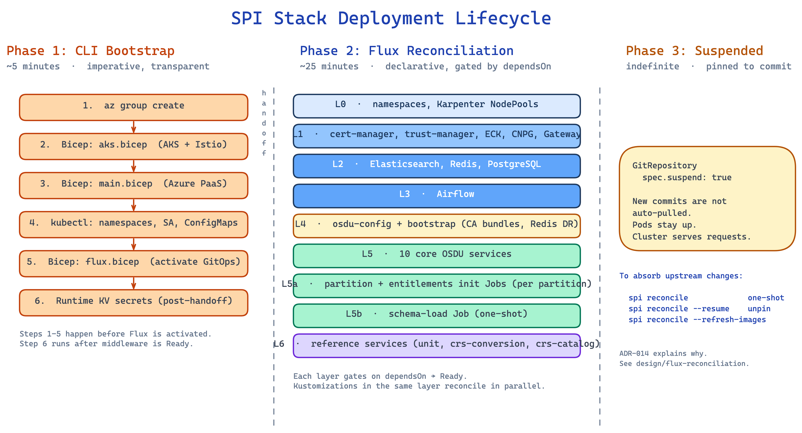

# Deployment Lifecycle

**What this explains.** Everything that happens between `spi up` exiting and a healthy OSDU cluster serving requests, broken into three phases with concrete timings.

**Why it matters.** A `spi up` of the default profile takes ~45-50 minutes, dominated by AKS Automatic provisioning. If you do not know what phase you are in, a long wait on what looks like silence feels like a bug. This doc lays out the phases so you can watch the right signals.

> **Companion docs.** [Bicep architecture](bicep-architecture.md) covers what each Bicep deployment lands. [Flux reconciliation](flux-reconciliation.md) covers the layer DAG from the reconcile-loop perspective. Read this for "where am I in the spi up wait."

## The three phases



| Phase | Who drives it | Duration | What it produces |
|---|---|---|---|
| 1. CLI bootstrap | The `spi` CLI | ~40-45 min | A cluster with the AKS Flux extension installed and a `GitRepository` registered |
| 2. Flux reconciliation | Flux CD | ~10-30 min | A healthy cluster running the chosen profile and ingress mode |
| 3. Suspended steady state | No one | indefinite | Pods keep running; Flux stops fetching new commits |

Phase 1 is the long pole: AKS Automatic provisioning alone takes ~30 min, with the Flux extension Bicep adding another ~10-15 min on top of the smaller PaaS deploy and K8s bootstrap.

## Phase 1: CLI bootstrap

The CLI is doing the minimum work needed to hand off to Flux. Every `az` and `kubectl` command it runs is printed in a Rich panel before execution so you can copy-paste it and re-run manually.

The sequence inside `deploy.deploy_azure()` is:

1. **Config resolution.** `Config.from_env()` takes `--env`, `--profile`, `--partition`, `--ingress-mode`, and applies defaults (region, derived cluster name, profile-driven layer wiring). Unless explicitly disabled, the CLI also resolves the current Azure caller from its access-token claims so Entitlements init can seed the same identifier the Gateway projects as `x-user-id`.
2. **Prerequisite check.** `check_prerequisites()` runs each tool in the registry (`az`, `bicep`, `kubectl`, `kubelogin`, `flux`, `helm`) and fails fast if anything is missing.
3. **Resource group.** `az group create --name spi-stack-<env> --location <region>`. The one thing Bicep cannot do itself.
4. **Key Vault soft-delete recovery.** If a prior `spi down` left a soft-deleted Key Vault with the same name, `az keyvault recover` brings it back so the upcoming Bicep deploy does not collide.
5. **`infra/aks.bicep` deploy.** AKS Automatic cluster, BYO VNet + NAT gateway, managed system node subnet, managed Istio. This is the slowest single step (~30 min).
6. **`az aks get-credentials`** merges the kubeconfig.
7. **`az aks mesh enable-istio-cni`.** The resource provider rejects the Istio CNI knob at create time, so the CLI patches it imperatively. See [ADR-008](../decisions/008-bicep-for-azure-provisioning.md).
8. **`infra/main.bicep` deploy.** Identity, RBAC, Key Vault (with Bicep-resolved secrets), ACR, Cosmos DB Gremlin, per-partition (Cosmos SQL + Service Bus + Storage), common Storage, optional `external-dns-*` for `dns` ingress. (The VNet is provisioned by `aks.bicep`, not here.)
9. **K8s bootstrap.** `kubectl apply` for namespaces, StorageClasses, the middleware secret seed (`spi-secrets`) plus the `platform`/`osdu` credential Secrets, `workload-identity-sa` (in `platform` and `osdu`), the `osdu-config` ConfigMap, the `spi-ingress-config` ConfigMap, the `osdu-image-lock` ConfigMap (resolved live from the OSDU community registry per [ADR-017](../decisions/017-osdu-image-lock.md)), the `spi-init-values` ConfigMap (partitions plus creator identity), and the Istio JWT projection resources from [ADR-016](../decisions/016-istio-jwt-projection.md).
10. **`infra/flux.bicep` deploy.** Activates the AKS Flux extension and creates the `fluxConfigurations` resource with two top-level Kustomizations: `stack` (pointing at `./software/stacks/osdu/profiles/<profile>`) and `ingress` (pointing at `./software/stacks/osdu/ingress/<mode>`).
11. **Runtime Key Vault secrets.** The CLI writes the in-cluster middleware secrets to Key Vault (per-partition Elasticsearch credentials, Redis hostname/password) directly from the generated seed passwords — no wait for middleware Ready, since the values are known once infra is up. See [ADR-010](../decisions/010-keyvault-secret-management.md).
12. **Suspend pin.** `_pin_gitops_source()` waits up to 120s for `gitrepository/osdu-spi-stack-system` to reach `Ready=True`, then `kubectl patch spec.suspend: true`. See [ADR-014](../decisions/014-suspend-gitops-after-deploy.md).
13. **Next-steps panel.** The CLI prints `spi status --watch`, `spi info`, and the matching `spi down` command with flags pre-filled.

At this point the CLI exits. You have a cluster with Flux installed, a suspended `GitRepository`, all `Kustomization` definitions queued, and the runtime KV secrets in place. The OSDU services have not finished starting yet.

## Phase 2: Flux reconciliation

From the moment Phase 1 ends, Flux owns the cluster. The two top-level Kustomizations (`stack` and `ingress`) reconcile in parallel; their child Kustomizations reconcile in dependency order from the profile `stack.yaml`.

The `core` profile produces this DAG (simplified):

```
L0a  spi-namespaces
       |
       +--> L0b  spi-nodepools                            (ADR-018)
       +--> L1   spi-cert-manager, spi-trust-manager,
       |          spi-eck-operator, spi-cnpg-operator
       |          |
       |          +--> L2   spi-elasticsearch, spi-redis, spi-postgresql
       |                     |
       |                     +--> L3   spi-airflow
       |
       +--> L4a  spi-osdu-config
                 |
                 +--> L4b  spi-bootstrap     (trust-manager Bundles + Redis DR)
                            |
                            +--> L5   spi-osdu-services   (10 services)
                                       |
                                       +--> L5a  spi-osdu-init       (partition + entitlements, ADR-015)
                                                  |
                                                  +--> L5b  spi-osdu-schema-load    (ADR-013)
                                                             |
                                                             +--> L6  spi-osdu-reference
```

The selected ingress profile adds the sole L1 `spi-gateway` owner and its L6 routes. Each edge is a `dependsOn` entry. Each dependency gates on the parent's health check. See [flux reconciliation](flux-reconciliation.md) for the full mechanics.

Rough timing on the default profile with a freshly-deployed cluster:

| Layer | Wall time | Notes |
|---|---|---|
| L0 Namespaces + NodePools | <30 s | Just `kubectl apply` then Karpenter |
| L1 Operators + Gateway | ~2 min | HelmReleases pulling charts, CRDs registering |
| L2 Middleware | ~3-4 min | Elasticsearch HTTP CA + 3-node startup is the long pole |
| L3 Airflow | ~1-2 min | Needs Postgres Ready |
| L4 Config + bootstrap | <30 s | ConfigMaps + trust-manager Bundles + Redis DestinationRule |
| L5 10 core OSDU services | ~3-4 min | Spring Boot startup, 10 HelmReleases install in parallel |
| L5a Partition + entitlements init | <1 min | Two Jobs per partition, each one HTTP call |
| L5b Schema load | ~3-5 min | 1,386 schemas POSTed one by one |
| L6 Reference services | ~2 min | crs-conversion downloads SIS data in its init container |

*Times measured on `Standard_D8s_v5` Karpenter nodes against a warm AKS quota; tune to your own region and quota.*

What to watch while Phase 2 runs:

```bash
spi status --watch
```

The dashboard groups Kustomizations by layer, shows HelmRelease status, the schema-load Job, and the per-partition init Jobs. Anything stuck at `False` for more than a few minutes points to the layer where the chain is blocked.

```bash
kubectl get kustomizations -n flux-system --watch
```

The raw Flux view if you need to confirm exact condition messages.

## Phase 3: Suspended steady state

When Phase 2 finishes, every Kustomization reports `READY=True`, every pod is `Running`, and the cluster serves requests. The `GitRepository` is still suspended from Phase 1.

The most common source of confusion: **suspended does not mean stopped.** The cluster is fully operational. The thing that is suspended is Flux's polling of the `GitRepository`. If you push a commit to the repo, Flux ignores it until you resume.

```bash
spi reconcile                  # one-shot reconcile, stays suspended
spi reconcile --resume         # unpin (auto-reconciliation back on)
spi reconcile --suspend        # re-pin
spi reconcile --refresh-images # re-resolve osdu-image-lock and reconcile services
```

`spi status` and `spi info` show a `SUSPENDED` banner when the `GitRepository` is pinned.

## Phase 4: Teardown

```bash
spi down --env <env>
```

This deletes the resource group, which removes the AKS cluster, every PaaS resource it provisioned, and the role assignments scoped at the resource group. The Key Vault enters soft-delete; the next `spi up --env <env>` recovers it in Phase 1 step 4.

## Worked example: `spi up --env dev1`, what you should see

```bash
$ uv run spi up --env dev1
```

Milestones to watch for in the CLI output:

1. **"Resource group spi-stack-dev1 ready"** -- Phase 1 step 3.
2. **"AKS deployment complete"** -- Phase 1 step 5. The cluster exists.
3. **"PaaS deployment complete"** -- Phase 1 step 8. Cosmos, Service Bus, Storage, Key Vault, ACR are live.
4. **"Flux extension activated"** -- Phase 1 step 10. Flux is running in `flux-system`.
5. **"Writing runtime KV secrets"** -- Phase 1 step 11. Redis/Elasticsearch credentials are written to Key Vault from the seed.
6. **"GitRepository suspended"** -- Phase 1 step 12. CLI is about to exit.

Switch to another terminal:

```bash
uv run spi status --watch
```

You see the layers come up in order. Once every Kustomization is Ready and every pod is `Running`:

```bash
uv run spi info
```

returns the gateway hostname / IP and (with `--show-secrets`) the Workload Identity client ID for token requests. The cluster is testable.

## Related ADRs

- [ADR-008](../decisions/008-bicep-for-azure-provisioning.md) -- Bicep for Azure Provisioning
- [ADR-009](../decisions/009-flux-cd-for-gitops.md) -- Flux CD + AKS GitOps Extension
- [ADR-014](../decisions/014-suspend-gitops-after-deploy.md) -- Suspend GitOps After Deploy
- [ADR-017](../decisions/017-osdu-image-lock.md) -- Per-Deploy Image Lock

## Source files

- `src/spi/cli.py` -- `up`, `down`, `reconcile`, `status`, `info`, `check`, `update` commands
- `src/spi/deploy.py` -- Phase 1 orchestrator (`deploy_azure`); `osdu-config` ConfigMap, workload-identity ServiceAccounts, Istio JWT projection, runtime KV writes, `_pin_gitops_source()`
- `src/spi/azure_infra.py` -- Azure infra provisioning (`provision_azure_infra`: RG, AKS, `main.bicep`, KV recovery)
- `src/spi/bicep.py` -- `az deployment group create` wrapper
- `src/spi/bootstrap.py` -- K8s bootstrap (namespaces, StorageClasses, Gateway API CRDs)
- `src/spi/secrets.py` -- middleware secret seed + `platform`/`osdu` credential Secrets
- `src/spi/images.py` -- resolves and renders `osdu-image-lock`
- `infra/aks.bicep`, `infra/main.bicep`, `infra/flux.bicep` -- the three Bicep entrypoints
- `software/stacks/osdu/profiles/core/stack.yaml` -- the layer DAG
