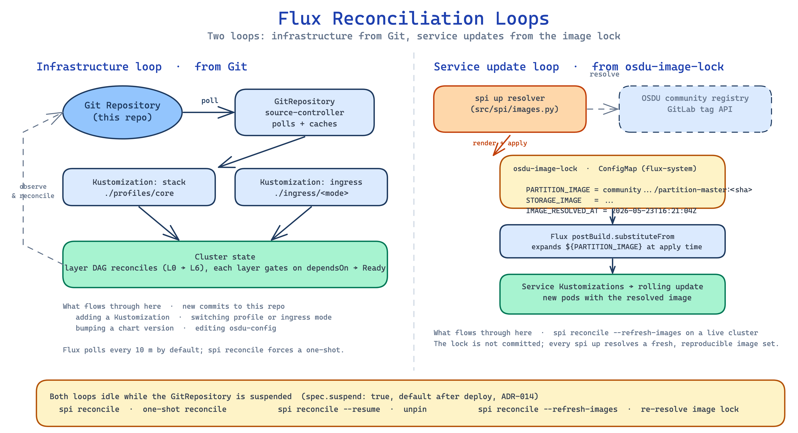

# Flux Reconciliation

**What this explains.** How the layer DAG composes, how `dependsOn` gates work in practice, how the `osdu-image-lock` ConfigMap drives service updates through Flux post-build substitution, and what suspend and resume actually do.

**Why it matters.** Flux owns everything inside the cluster after the CLI hands off. When a layer is stuck or a service does not pick up a new image, the answer is in this loop, not in the CLI.

> **Companion docs.** [Deployment lifecycle](deployment-lifecycle.md) covers timing and what the CLI does before Flux. [Bicep architecture](bicep-architecture.md) covers what produces the `fluxConfigurations` resource that activates this loop.

## The two reconciliation loops



Two loops keep the cluster converged. They run independently and idle in lockstep with the suspend state on the `GitRepository`.

### Infrastructure loop (from Git)

Changes to this repository flow through the Flux `GitRepository` source. The source-controller polls the remote on a 10-minute interval (when not suspended) and caches the latest revision. The two top-level Kustomizations (`stack` and `ingress`) reconcile from that cache; their child Kustomizations reconcile in dependency order.

Changes that flow through this loop:

- A new Kustomization added under `software/stacks/osdu/profiles/<profile>/`.
- A profile or ingress-mode swap. Both are Bicep parameters on `infra/flux.bicep`; the resulting parameter change re-deploys `flux.bicep`, which re-applies the `fluxConfigurations` resource with the new Kustomization paths.
- A chart version bump in any `HelmRelease`.
- An edit to the `osdu-config` ConfigMap that's checked into Git (the runtime `osdu-config` written by the CLI is a separate ConfigMap with `app.kubernetes.io/managed-by: osdu-spi-stack`).

### Service update loop (from `osdu-image-lock`)

OSDU service images move on a different cadence than the repo. Per [ADR-017](../decisions/017-osdu-image-lock.md), `spi up` queries the OSDU community GitLab registry for the newest immutable SHA tag per service, renders the result into a `osdu-image-lock` ConfigMap in `flux-system`, and applies it.

The service Kustomizations under `software/stacks/osdu/profiles/core/` carry `postBuild.substituteFrom` blocks that reference `osdu-image-lock`. When Flux reconciles those Kustomizations, the `${PARTITION_IMAGE_REPOSITORY}` and `${PARTITION_IMAGE_TAG}` expressions in the rendered YAML expand against the live ConfigMap. Updating the lock and reconciling the Kustomization triggers a rolling update.

The CLI is the only writer of `osdu-image-lock`. `spi reconcile --refresh-images` re-resolves and re-applies the lock, then forces a reconcile on the service Kustomizations. Nothing else moves service image tags.

## The layer DAG (core profile)

`software/stacks/osdu/profiles/core/stack.yaml` declares every Kustomization with explicit `dependsOn`. The result is the ordering shown in [deployment-lifecycle.md](deployment-lifecycle.md#phase-2-flux-reconciliation):

```
L0a spi-namespaces            (no deps)
L0b spi-nodepools             dependsOn: spi-namespaces           (ADR-018)
L1  spi-cert-manager          dependsOn: spi-namespaces
    spi-trust-manager         dependsOn: spi-cert-manager
    spi-eck-operator          dependsOn: spi-namespaces
    spi-cnpg-operator         dependsOn: spi-namespaces
    spi-gateway               dependsOn: spi-namespaces
L2  spi-elasticsearch         dependsOn: spi-eck-operator, spi-nodepools
    spi-redis                 dependsOn: spi-cert-manager, spi-nodepools
    spi-postgresql            dependsOn: spi-cnpg-operator, spi-nodepools
L3  spi-airflow               dependsOn: spi-postgresql
L4a spi-osdu-config           dependsOn: spi-namespaces
L4b spi-bootstrap             dependsOn: spi-trust-manager, spi-elasticsearch, spi-redis, spi-osdu-config
L5  spi-osdu-services         dependsOn: spi-bootstrap, spi-nodepools
L5a spi-osdu-init             dependsOn: spi-osdu-services        (ADR-015)
L5b spi-osdu-schema-load      dependsOn: spi-osdu-init            (ADR-013)
L6  spi-osdu-reference        dependsOn: spi-osdu-services, spi-osdu-schema-load
```

The `ingress` Kustomization (`software/stacks/osdu/ingress/<mode>/stack.yaml`) attaches additional Kustomizations at L1 (cert issuers, ExternalDNS for `dns`, TLS overlays) and L6 (HTTPRoutes). See [ADR-007](../decisions/007-layered-kustomization-ordering.md) and [gateway-ingress](gateway-ingress.md).

## How `dependsOn` actually gates

A Kustomization with `wait: true` (every Kustomization in the SPI stack uses this) reports `Ready=True` only after every resource it applies passes its health check. A downstream Kustomization with `dependsOn: [...]` does not start until every named upstream reports `Ready=True`.

Two gotchas worth knowing:

1. **`wait: true` is per-layer slow.** A slow operator delays everything behind it. Per-layer `timeout` is tuned in `stack.yaml` (15 min for Elasticsearch and Airflow, 30 min for the OSDU service layers, 35 min for schema-load). Bumping a timeout is a real change; bump it deliberately, not reflexively.
2. **Cross-Kustomization dependencies are not transitive.** L5 dependsOn L4b but not L1; if L1 breaks, L5 reports its own gate as unmet (L4b never went Ready), not "L1 broken." Trace the chain upward to find the root.

When debugging a stuck layer:

```bash
flux get kustomizations -n flux-system
spi status                                # grouped by layer, easier on the eye
kubectl describe kustomization spi-elasticsearch -n flux-system
```

The `Conditions:` block on the Kustomization names the upstream that has not gone Ready (`dependency not ready`) or the in-layer resource that failed its health check.

## `postBuild.substituteFrom` for service images

The service Kustomizations look roughly like:

```yaml
apiVersion: kustomize.toolkit.fluxcd.io/v1
kind: Kustomization
metadata:
  name: spi-osdu-services
spec:
  path: ./software/stacks/osdu/services
  dependsOn:
    - name: spi-bootstrap
  wait: true
  postBuild:
    substituteFrom:
      - kind: ConfigMap
        name: osdu-image-lock
        namespace: flux-system
```

When Flux fetches the manifests under `./software/stacks/osdu/services/`, it expands every `${...}` reference in the rendered YAML against the ConfigMap. Each per-service `HelmRelease` carries values like:

```yaml
spec:
  values:
    image:
      repository: ${PARTITION_IMAGE_REPOSITORY}
      tag: ${PARTITION_IMAGE_TAG}
```

So changing the ConfigMap changes the resolved image on the next reconcile. The lock is the entire pin surface; no service YAML has a static image tag.

## Suspend and resume

`spi up` ends with `kubectl patch gitrepository/osdu-spi-stack-system --type=merge -p '{"spec":{"suspend":true}}'`. This stops the source-controller from polling and stops Flux from auto-applying new revisions. It does **not** stop downstream Kustomizations from reconciling against the cached revision; Phase 2 runs to completion exactly as ADR-014 promises.

| Command | Effect | Suspended after? |
|---|---|---|
| `spi reconcile` | One-shot reconcile (annotates the source + stack Kustomization with `reconcile.fluxcd.io/requestedAt`) | yes (unchanged) |
| `spi reconcile --suspend` | Set `spec.suspend: true` if not already | yes |
| `spi reconcile --resume` | Set `spec.suspend: false` (Flux resumes 10-min polling) | no |
| `spi reconcile --refresh-images` | Re-resolve `osdu-image-lock`, re-apply, then reconcile service Kustomizations | yes (unchanged) |

`spi status` and `spi info` both show a yellow `SUSPENDED` banner when the source is pinned.

## Worked example: debug a stuck service

Symptom: `spi osdu-services` reports `Ready=False` after the timeout.

```bash
$ flux get kustomizations -n flux-system | grep osdu
spi-osdu-services    False   1m   ... dependency not ready
spi-osdu-init        False   1m   ... blocked
spi-osdu-schema-load False   1m   ... blocked
spi-bootstrap        False   12m  ... HealthCheckFailed: redis-disable-mtls
```

The chain: `spi-osdu-services` waits on `spi-bootstrap`, which failed its health check on the Redis `DestinationRule`. Drill into that Kustomization:

```bash
$ kubectl describe kustomization spi-bootstrap -n flux-system
... Status: ReconciliationFailed
... Message: networking.istio.io/v1beta1/DestinationRule/osdu/redis-disable-mtls:
   redis-disable-mtls not found
```

The Istio CRD has not registered yet, or the namespace is wrong. `kubectl get crd | grep istio` confirms. Fix the upstream (`spi-gateway` Kustomization or the AKS Istio extension), reconcile, and the chain unblocks layer by layer.

The same pattern works for HelmRelease failures (`flux get helmreleases -n flux-system`), schema-load Job failures (`kubectl logs job/schema-load -n osdu`), and image substitution failures (`kubectl get cm osdu-image-lock -n flux-system -o yaml` shows the resolved values).

## Worked example: refresh service images on a live cluster

```bash
$ uv run spi reconcile --refresh-images
[CLI]   resolving OSDU community registry...
[CLI]   resolved 13 images (PARTITION_IMAGE_TAG=ab12cd34..., ...)
[CLI]   kubectl apply -f -  (osdu-image-lock)
[Flux]  reconciling kustomization spi-osdu-services
[Flux]  HelmRelease partition upgraded
```

Pods roll one at a time as each `HelmRelease` reconciles. `spi status --watch` shows the progression.

## Related ADRs

- [ADR-007](../decisions/007-layered-kustomization-ordering.md) -- Layered Flux Kustomization Ordering
- [ADR-009](../decisions/009-flux-cd-for-gitops.md) -- Flux CD + AKS GitOps Extension
- [ADR-013](../decisions/013-schema-load-flux-job.md) -- Schema Load via a Flux-Managed Job
- [ADR-014](../decisions/014-suspend-gitops-after-deploy.md) -- Suspend GitOps After Deploy
- [ADR-015](../decisions/015-partition-entitlements-bootstrap.md) -- Partition + Entitlements Bootstrap
- [ADR-017](../decisions/017-osdu-image-lock.md) -- Per-Deploy Image Lock
- [ADR-018](../decisions/018-karpenter-nodepool-authoring.md) -- Karpenter NodePool Authoring

## Source files

- `software/stacks/osdu/profiles/core/stack.yaml` -- the layer DAG
- `software/stacks/osdu/ingress/<mode>/stack.yaml` -- ingress overlay Kustomizations
- `src/spi/images.py` -- `osdu-image-lock` rendering
- `src/spi/deploy.py` -- `_pin_gitops_source`, `reconcile_gitops_source`
- `src/spi/guard.py` -- suspend status checks
- `src/spi/status.py` -- the layer-grouped dashboard
