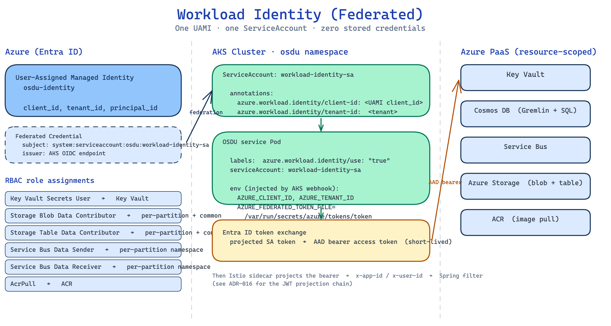

# Workload Identity

**What this explains.** How one Managed Identity becomes a usable runtime credential inside an OSDU service pod, how the JWT projection in ADR-016 turns the resulting AAD bearer into a `x-app-id` header, and where the carve-out for indexer-queue lives.

**Why it matters.** "Workload Identity" sounds like one thing but is actually a federation chain across Entra ID, the AKS OIDC issuer, the AKS webhook, the Istio sidecar, and the service's Spring filter. Failures in any link surface as the same symptom: a 401 or 403 with an empty `app-id=`. This doc names each link so you can trace which one is broken.

> **Companion docs.** [Bicep architecture](bicep-architecture.md) covers the modules that provision the identity and RBAC. [Secret lifecycle](secret-lifecycle.md) covers the Key Vault side. [Gateway and ingress](gateway-ingress.md) covers what happens at the edge before the bearer arrives.

## The federation chain

Five steps from Azure to a usable bearer token inside a pod:

1. **The UAMI exists.** `infra/modules/identity.bicep` creates the OSDU UAMI (`<cluster>-osdu-identity`, a `Microsoft.ManagedIdentity/userAssignedIdentities` resource). The UAMI has a `client_id`, a `tenant_id`, and a `principal_id`.
2. **The federated credentials bind the UAMI to the ServiceAccount.** The same module creates one `federatedIdentityCredentials` subresource per namespace in the fixed OSDU set (`default`, `osdu-core`, `airflow`, `osdu-system`, `osdu-auth`, `osdu-reference`, `osdu`, `platform`), each with `subject` `system:serviceaccount:<ns>:workload-identity-sa`; the `issuer` is the AKS cluster's OIDC discovery URL (a property of the cluster, populated by AKS automatically).
3. **The RBAC bindings make the UAMI useful.** `infra/modules/rbac.bicep` assigns six roles scoped per resource: `Key Vault Secrets User`, `Storage Blob Data Contributor`, `Storage Table Data Contributor`, `Service Bus Data Sender`, `Service Bus Data Receiver`, `AcrPull`. Per [ADR-005](../decisions/005-workload-identity.md), the SPI stack uses one shared identity rather than per-service identities.
4. **The ServiceAccount carries the link annotations.** During K8s bootstrap (`src/spi/deploy.py`, `_create_osdu_config`), the CLI creates `workload-identity-sa` in the `platform` and `osdu` namespaces with two annotations: `azure.workload.identity/client-id: <UAMI client_id>` and `azure.workload.identity/tenant-id: <tenant>`. Pods that mount this ServiceAccount inherit the annotations.
5. **The pod opts in with a label.** A service pod includes `azure.workload.identity/use: "true"` in its labels. The AKS webhook sees the label, looks at the ServiceAccount annotations, mounts a projected SA token at `/var/run/secrets/azure/tokens/token`, and injects three env vars: `AZURE_CLIENT_ID`, `AZURE_TENANT_ID`, `AZURE_FEDERATED_TOKEN_FILE`.

At runtime, the Azure SDK in the service (or the OSDU `core-lib-azure`) reads the projected token, exchanges it with Entra ID's `oauth/v2.0/token` endpoint, and gets an AAD bearer scoped to whatever audience the SDK asks for. The token is short-lived and refreshed automatically; nothing is stored on disk.

## What the bearer actually looks like

A token minted via Workload Identity is a JWT signed by Entra ID with:

- `iss` (issuer): one of `https://login.microsoftonline.com/<tenant>/v2.0` (v2) or `https://sts.windows.net/<tenant>/` (v1).
- `aud` (audience): the resource scope requested by the SDK.
- `appid`: the UAMI client_id (v1) or `azp`/`oid` (v2).

Two audiences land in SPI Stack flows:

| Caller | Audience | Why |
|---|---|---|
| Bootstrap Jobs (partition-init, entitlements-init, schema-load) | `https://management.azure.com/` | The Job uses MSAL with the management scope to get a single bearer for in-cluster service-to-service calls |
| Steady-state service-to-service traffic via `core-lib-azure.getWIToken` | `${aadClientId}/.default` | core-lib-azure mints calls with the OSDU AAD app id as scope |

Both must validate at the Istio JWT projection layer for the request to be admitted.

## What ADR-016's JWT projection does next

Workload Identity gets the bearer **into** the pod. ADR-016 is about what happens **between the bearer and the Java Spring filter** in the Azure-provider service images.

The Azure-provider OSDU service images (`*-service-azure:*`) include an in-process Spring filter that reads the caller's application identity from a request header, not from the bearer directly. The header has to be populated by the Istio sidecar before the request reaches Java. With no Istio policy in place, the header is absent and authorization fails before any business logic runs.

The SPI Stack CLI applies three Istio resources during K8s bootstrap (Phase 1, step 9 in [deployment-lifecycle](deployment-lifecycle.md)):

- **`RequestAuthentication` `spi-osdu-jwt-authn`** validates the bearer against both AAD v1 and v2 issuers, with audiences `{client_id}` and `https://management.azure.com[/]`. Configured with `outputPayloadToHeader: x-payload` so the decoded JWT lands in Envoy dynamic metadata.
- **`EnvoyFilter` `spi-osdu-identity-filter`** on `SIDECAR_INBOUND`. Lua reads the JWT metadata and writes `x-app-id` / `x-user-id`. The branch that special-cases `aud == https://management.azure.com/` writes the OSDU UAMI client_id into both headers (so bootstrap Jobs with management-scope bearers land with the right `app-id`).
- **`PeerAuthentication` `spi-osdu-mtls`** in `PERMISSIVE` mode in `osdu`. Defensive against managed-mesh defaults that could otherwise break the init Jobs.

Because the projection runs inside the sidecar, the same path serves bootstrap Jobs, steady-state service-to-service calls, and external client calls through the gateway. The Spring filter does not care where the header came from; it just needs `x-app-id` populated.

## The audience list (and how to break it)

ADR-016 calls this out as the most common failure mode. The `RequestAuthentication` audience list must include every value services use to mint service-to-service tokens.

- The bootstrap Jobs use `aud=https://management.azure.com/`. That audience is in the default list.
- `core-lib-azure.getWIToken` uses scope `${aadClientId}/.default`. By default `aadClientId` is the UAMI client_id, which is in the audience list. If the operator overrides `AAD_CLIENT_ID` to a separate OSDU AAD app registration, the appid of that registration must also be in the audience list.

`istio_auth_resources()` in `src/spi/templates.py` accepts both `entra_client_id` (UAMI) and `aad_client_id` and emits both, deduped when they match. When the override is in play, both end up in the audience list.

The symptom of a missing audience is identical to "Workload Identity broken": empty `app-id=` in the service's request log, 403 from partition or 401 from entitlements. The cure is to verify the audience list, not to debug the federation chain.

## The indexer-queue carve-out

Per [ADR-005](../decisions/005-workload-identity.md) "Consequences," indexer-queue is the one carve-out. The `indexer-queue-master` image (current `core-lib-azure` 2.0.6) builds its Service Bus subscription client via `SubscriptionClientFactoryImpl`, which constructs a `ConnectionStringBuilder` regardless of the `AZURE_PAAS_WORKLOADIDENTITY_ISENABLED` flag. Without a real connection string the subscription client throws `IllegalConnectionStringFormatException` on every retry and records-changed events never reach the indexer.

The CLI accepts this carve-out by storing a real Service Bus SAS connection string in `{partition}-sb-connection`. The key is gated by the same UAMI's `Key Vault Secrets User` role; it never lands in a pod env var. When the upstream subscription client honors the Workload Identity flag, this can move back to a `"DISABLED"` placeholder like the other partition KV secrets.

## Worked example: trace a "401 with empty app-id" failure

The symptom: `kubectl logs deploy/partition -n osdu | grep TxnLogger` shows `app-id=` empty even though the caller has a valid bearer.

Step by step:

1. **Confirm the bearer is reaching the sidecar.** `kubectl logs <pod> -c istio-proxy -n osdu | grep jwt_authn` should show a `jwt_authn` admit. If it shows a reject, the bearer is invalid; check audience and issuer.
2. **Confirm `x-payload` is being projected.** The `RequestAuthentication` writes the decoded JWT to `x-payload`. If `x-payload` is missing from the request the service sees, the Lua filter is not firing; check that the `EnvoyFilter` is present (`kubectl get envoyfilter -n osdu`).
3. **Confirm the Lua mapping.** The Lua reads `envoy.filters.http.jwt_authn` dynamic metadata. If the audience does not match one of the branches in the Lua, `x-app-id` is left empty even though `x-payload` was projected.
4. **Confirm the audience list.** `kubectl get requestauthentication -n osdu -o yaml | grep -A5 audiences`. If `AAD_CLIENT_ID` is overridden and the AAD appid is missing here, that is the bug. Fix `deploy.py`'s `_create_istio_auth()` (which calls `istio_auth_resources()`), re-run the CLI step (or `kubectl apply` the generated RA manually), and retry.

Three checks, each with a definitive answer. The full chain is small once you can name each link.

## Worked example: how to add a new RBAC scope

Suppose a new service needs `Storage File Data SMB Share Contributor` on a particular Storage account.

1. **Add the role assignment to `infra/modules/rbac.bicep`.** Define a new `Microsoft.Authorization/roleAssignments` with the new role definition ID, scoped to the storage account resource ID, principal: the UAMI principal ID.
2. **Wire it in `infra/main.bicep`.** Pass the storage account resource into the `rbac` module call.
3. **Redeploy.** `spi up --env <env>` re-runs `main.bicep`. ARM is idempotent on role assignments; the new one lands, existing ones are untouched.

No change to the federation chain, no change to the ServiceAccount, no change to pod templates. That is the point of one shared identity.

## Related ADRs

- [ADR-002](../decisions/002-aks-automatic.md) -- AKS Automatic (provides the OIDC issuer)
- [ADR-005](../decisions/005-workload-identity.md) -- Workload Identity for Azure PaaS Access
- [ADR-010](../decisions/010-keyvault-secret-management.md) -- Key Vault + ConfigMap Secret Model
- [ADR-016](../decisions/016-istio-jwt-projection.md) -- Istio JWT Projection

## Source files

- `infra/modules/identity.bicep` -- UAMI + federated credential
- `infra/modules/rbac.bicep` -- role assignments
- `src/spi/deploy.py` -- `osdu-config` ConfigMap, `workload-identity-sa`, Istio JWT projection (`_create_osdu_config`, `_create_istio_auth`)
- `src/spi/templates.py` -- `osdu_config_configmap()`, `workload_identity_sa()`, `istio_auth_resources()` templates
- `software/charts/osdu-spi-service/templates/deployment.yaml` -- the `azure.workload.identity/use` label and ServiceAccount binding
